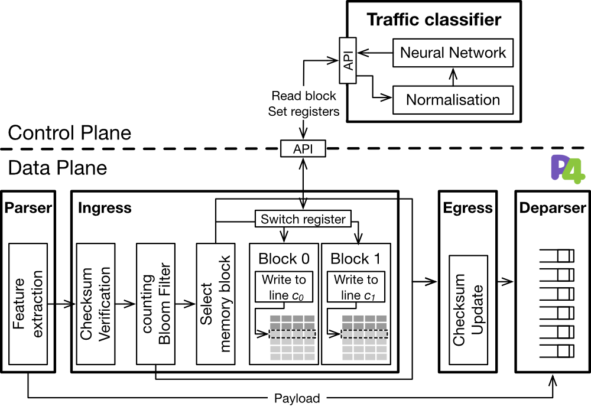

# P4DDLe: Introducing Packet-Level Analysis in Programmable Data Planes to Advance Network Intrusion Detection

P4DDLe is a framework that exploits the flexibility of P4-based programmable data planes for packet-level feature extraction and pre-processing. P4DDLe leverages the programmable data plane to extract raw packet features from the network traffic, categorical features included, and to organise them in a way that the semantics of traffic flows is preserved. To minimise memory and control channel overheads, P4DDLe selectively processes and filters packet-level data, so that all and only the relevant features required by the NIDS are collected.  The experimental evaluation with recent Distributed Denial of Service (DDoS) attack data demonstrates that the proposed approach is very efficient in collecting compact and high-quality representations of network flows, ensuring precise detection of DDoS attacks.

More details on the architecture of P4DDLe, its performance and experiments are available in the following research paper:

R. Doriguzzi-Corin, L.A. Dias Knob, L. Mendozzi, D. Siracusa and M. Savi. "Introducing Packet-Level Analysis in Programmable Data Planes to Advance Network Intrusion Detection". *arXiv preprint arXiv:2002.04902*, 2023.

## Simulation Scenario

We implement a python script that simulate the P4DDLe and the Baseline algorithms with the 

### Dataset

We utilise the profile outlined in [1] to simulate the traffic of a realistic network. This profile was generated using network activity data gathered from a university campus. From it, we extracted the distribution of TCP, UDP, and other protocols and we computed the average number of packets/flow for each protocol.

[1] *Jurkiewicz, P., Rzym, G., & Boryło, P. (2021). Flow length and size distributions in campus Internet traffic. Computer Communications, 167, 15-30.*

### Settings and Execution

Besides Python, you also need to install a series of packages to run the simulation script. The packages can be installed with the following command:

```
pip install numpy scipy pandas
```

After configure the scenario in the *sim.ini* configuration file, the simulation can be run with the command:

```
python simflow/sim.py
```

The results from the simulation will be saved in the *simflow/logs* folder in the CSV format.

## Emulation Scenario



### LUCID: A practical, lightweight deep learning solution for DDoS attack detection

To validated our approach to data plane, we adopt a state-of-the-art solution for DDoS attack detection callled Lightweight, Usable CNN in DDoS Detection (LUCID)[2]. LUCID is a lightweight Deep Learning-based DDoS detection framework suitable for online resource-constrained environments, which leverages Convolutional Neural Networks (CNNs) to learn the behaviour of DDoS and benign traffic flows with both low processing overhead and attack detection time. LUCID includes a dataset-agnostic pre-processing mechanism that produces traffic observations consistent with those collected in existing online systems, where the detection algorithms must cope with segments of traffic flows collected over pre-defined time windows.

[2] *Doriguzzi-Corin, R., Millar, S., Scott-Hayward, S., Martinez-del-Rincon, J., & Siracusa, D. (2020). LUCID: A practical, lightweight deep learning solution for DDoS attack detection. IEEE Transactions on Network and Service Management, 17(2), 876-889.*

### Dataset

P4DDLe is evaluated using CIC-DDoS2019 [3], a recent dataset of DDoS attacks provided by the Canadian Institute of Cybersecurity at the University of New Brunswick. This dataset contains multiple days of network activity, including benign traffic and 13 distinct types of DDoS attacks. To mitigate the impact of BMv2’s poor performance [3], we made a strategic decision to exclude all attacks with a packet rate higher than 30 kpackets/s from the test set.

[3] *Sharafaldin, I., Lashkari, A. H., Hakak, S., & Ghorbani, A. A. (2019, October). Developing realistic distributed denial of service (DDoS) attack dataset and taxonomy. In 2019 International Carnahan Conference on Security Technology (ICCST) (pp. 1-8). IEEE.*

### Settings and Execution

Information about the settings and how to execute each algorithm can be found on the README of each specific folder.

## Acknowledgements

If you are using P4DDLe's code for a scientific research, please cite the related paper in your manuscript as follows:

*Doriguzzi-Corin, R., Dias Knob, L. A., Mendozzi, L., Siracusa, D., and Savi, M.. (2023) "Introducing Packet-Level Analysis in Programmable Data Planes to Advance Network Intrusion Detection". *arXiv preprint arXiv:2002.04902*.*

## License

The code is released under the Apache License, Version 2.0.
